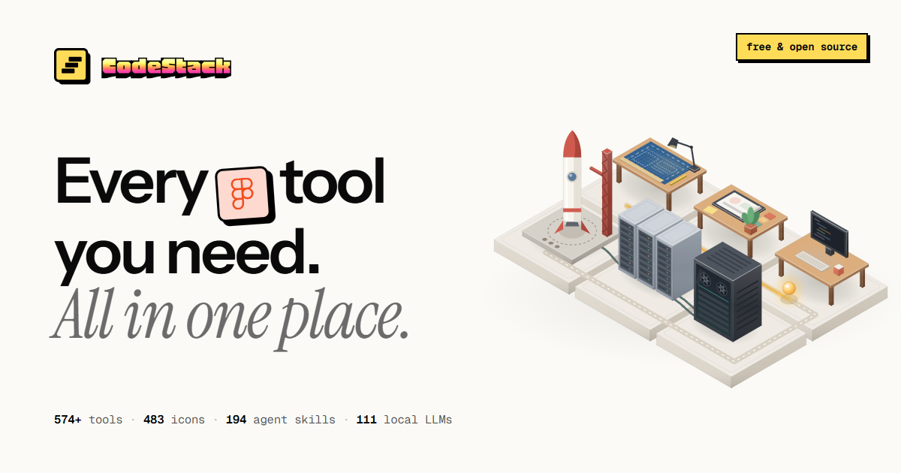

<div align="center">



# CodeStack

**Every tool you need. All in one place.**

A free, open source, hand‑picked home for the tools, brand icons, agent skills and learning resources
that designers and developers actually love. Curated by hand, shaped by the community.

[Explore](#features) · [Getting started](#getting-started) · [Add a tool](#adding-content) · [Contribute](#contributing)

</div>

---

## Table of contents

- [Why CodeStack](#why-codestack)
- [Features](#features)
- [Tech stack](#tech-stack)
- [Getting started](#getting-started)
- [Scripts](#scripts)
- [Project structure](#project-structure)
- [Adding content](#adding-content)
  - [Tools](#tools)
  - [Brand icons](#brand-icons)
  - [Learning resources](#learning-resources)
  - [Agent skills](#agent-skills)
  - [Stack presets](#stack-presets)
  - [Navigation menus](#navigation-menus)
- [Design system](#design-system)
- [Performance](#performance)
- [Accessibility](#accessibility)
- [SEO and sharing](#seo-and-sharing)
- [Deployment](#deployment)
- [Troubleshooting](#troubleshooting)
- [Contributing](#contributing)
- [Credits](#credits)

---

## Why CodeStack

Finding good tools means juggling dozens of bookmarks, outdated "awesome" lists and search results full of ads.
CodeStack puts the essentials for **both designers and developers** in one fast, beautiful place:

- Every entry is **chosen by hand** and links to its official site.
- Every learning resource and video link was **verified** when it was added.
- Everything is **free to use and open source**, and anyone can add to it with a single pull request.

## Features

| Page | What it does |
| --- | --- |
| **Home** (`/`) | A scroll‑linked hero with a 3D wall of brand logos, a logo marquee, "For designers / For developers" tiles, a category bento grid, a draggable feature carousel, live stats and an open source call to action. |
| **Explore** (`/explore`) | **316 tools across 19 categories**, from frameworks and databases to AI, mockups, 3D, typography and color. Search, filter by Design or Develop, and jump between categories. Links like `/explore?c=typography` open a filtered view directly. |
| **Icons** (`/icons`) | **141 brand logos.** Search, switch between color and mono, then copy any logo as **SVG** or a **React component**, or download **SVG** or **PNG** in brand, black or white. |
| **Learn** (`/learn`) | **194 verified resources across 9 tracks**: design, frontend, backend, DevOps, mobile, AI, CS fundamentals, full‑stack paths and career. Docs, courses, videos, guides, books, practice platforms and podcasts, with a "Start watching" row of must‑see videos and a "Free only" filter. |
| **Stack Builder** (`/stack-builder`) | Pick technologies or start from **9 proven presets** (T3, MERN, Supa‑Next, AI App and more). See how closely your stack matches the classics, share it as a link or copy it as Markdown. |
| **Agent Skills** (`/skills`) | **194 Agent Skills** for Claude Code, Codex, Cursor, Copilot, Gemini CLI and more, from **47 publishers** and organized into **12 fields**. Includes **Popular** picks from the skills.sh leaderboard, hand‑picked **Hidden gems** and one‑click install commands. |
| **Developer Roadmap** (`/roadmap`) | A roadmap.sh-style flowchart from idea to production in **28 steps across 7 phases** (Plan, Build, Secure, Verify, Ship, Run, Grow). Every box opens a panel with a checklist, the key rule, a mini flowchart, techniques and resources. Covers AI-assisted development, agent and MCP security, OWASP Top 10:2025, performance, SEO and GEO. Includes the AI-first loop, the optimization loop, five maturity levels (`?level=1` to `5` highlights a level), a final ship checklist and tips. Progress is saved in the browser. Content lives in `data/roadmap.ts`. |
| **Contribute** (`/contribute`) | Three ways to help, a four‑step guide with copyable commands, contribution guidelines and the code of conduct. |

Available everywhere:

- **⌘K / Ctrl+K search** (or press `/`): jump to any tool, category or page from anywhere.
- **Apple‑style navigation:** hover menus with dropdown arrows, a keyboard‑friendly layout, and a drill‑down menu on mobile.
- **Light and dark themes** that follow your system, with a manual toggle.
- **Responsive** from small phones to wide desktops, with no horizontal scrolling.

## Tech stack

| Area | Choice |
| --- | --- |
| Framework | [Next.js 15](https://nextjs.org) (App Router, fully static pages) |
| UI | [React 19](https://react.dev), [TypeScript](https://www.typescriptlang.org) |
| Styling | [Tailwind CSS 3](https://tailwindcss.com) with CSS variable design tokens, `tailwindcss-animate`, Autoprefixer |
| Motion | [Framer Motion](https://motion.dev) for interactions, plain CSS for first‑paint entrances |
| Components | [Radix Dialog](https://www.radix-ui.com), [cmdk](https://cmdk.paco.me) (command palette), [Sonner](https://sonner.emilkowal.ski) (toasts) |
| Theming | [next-themes](https://github.com/pacocoursey/next-themes) |
| Icons | [Lucide](https://lucide.dev) for interface icons, [Simple Icons](https://simpleicons.org) for brand logos |
| Fonts | Inter and Geist Mono via `next/font` (self‑hosted, no layout shift) |

## Getting started

**Requirements:** Node.js 20 or newer (22 recommended) and npm.

```bash
# 1. Clone the repository
git clone https://github.com/Skarycloud/codestack.git
cd codestack

# 2. Install dependencies
npm install

# 3. Start the development server
npm run dev
```

Open [http://localhost:3000](http://localhost:3000). Pages reload as you edit.

To check a production build locally:

```bash
npm run build
npm run start
```

## Scripts

| Command | What it does |
| --- | --- |
| `npm run dev` | Starts the development server on port 3000. Pass another port with `npm run dev -- -p 4000`. |
| `npm run build` | Creates an optimized production build. Every page is pre‑rendered as static HTML. |
| `npm run start` | Serves the production build. |
| `npm run typecheck` | Runs the TypeScript compiler without emitting files. Run this before opening a pull request. |
| `npm run icons` | Regenerates the brand logo sprite and metadata from Simple Icons. Run this after adding or changing an `icon` slug. |
| `npm run lint` | Runs Next.js linting. |

`dev`, `build` and `start` run through [`scripts/next.mjs`](scripts/next.mjs), a tiny wrapper that starts Next.js from the
project's canonical path. This prevents a Windows‑only bug where a lowercase drive letter (`d:\` instead of `D:\`)
causes "Could not find the module … in the React Client Manifest" errors. See [Troubleshooting](#troubleshooting).

## Project structure

```
codestack/
├── app/                      Routes (Next.js App Router)
│   ├── layout.tsx            Root layout: fonts, metadata, navbar, footer, providers
│   ├── page.tsx              Home
│   ├── explore/              Tool directory
│   ├── icons/                Brand icon library
│   ├── learn/                Learning resources
│   ├── stack-builder/        Stack Builder
│   ├── skills/               Agent Skills directory
│   ├── contribute/           Contribution guide and code of conduct
│   ├── not-found.tsx         Custom 404 page
│   ├── globals.css           Design tokens, type scale, utilities, keyframes
│   ├── icon.svg              Favicon (the Stacked Slash logo)
│   ├── opengraph-image.png   Social share image (+ twitter-image.png and alt text)
│   ├── sitemap.ts            Generates /sitemap.xml
│   └── robots.ts             Generates /robots.txt
│
├── components/
│   ├── site/                 Navbar (mega‑menu), footer, logo, theme toggle,
│   │                         providers and the lazy‑loaded ⌘K command palette
│   ├── home/                 Hero, icon wall, marquee, bento, carousel, stats, CTA
│   ├── explore/              Directory filters and grid
│   ├── icons/                Icon grid and export sheet
│   ├── learn/                Learn library, featured videos, video cards
│   ├── skills/               Skills directory and animated explainer cards
│   ├── stack/                Stack Builder
│   ├── contribute/           Copyable command block
│   ├── motion/reveal.tsx     Scroll‑reveal helpers
│   ├── brand-icon.tsx        Renders a brand logo from the SVG sprite
│   ├── drag-scroller.tsx     Full‑bleed, draggable, snapping horizontal scroller
│   ├── page-header.tsx       Shared page header (server component)
│   ├── segmented.tsx         iOS‑style segmented control
│   ├── switch-pill.tsx       iOS‑style labelled switch
│   └── tool-card.tsx         Tool card used across the site
│
├── data/                     All content lives here, as typed TypeScript
│   ├── catalog.ts            Tools and categories
│   ├── resources.ts          Learning resources, formats and tracks
│   ├── skills.ts             Agent skills, fields and publishers
│   ├── stacks.ts             Stack Builder presets and categories
│   ├── brand-meta.ts         Generated: logo titles, colors, sprite version
│   └── brand-icons.ts        Generated: full logo paths (Icons page only)
│
├── lib/
│   ├── site.ts               Site name, URL, repository and social links
│   ├── nav.ts                Navbar menus (built from the data files)
│   ├── brand-svg.ts          SVG and JSX export helpers for the icon library
│   ├── color.ts              Luminance helpers that keep dark logos visible
│   └── utils.ts              `cn()` class name helper
│
├── public/
│   └── brand-icons.svg       Generated logo sprite (cached by the browser)
│
└── scripts/
    ├── generate-icons.mjs    Builds the sprite and metadata from Simple Icons
    └── next.mjs              Windows‑safe launcher for the Next.js CLI
```

## Adding content

All content lives in typed files in [`data/`](data). There is no database and no CMS: add an entry, run the type checker,
and open a pull request. Search, counts, filters and navigation menus all update automatically.

### Tools

Add an entry to the `tools` array in [`data/catalog.ts`](data/catalog.ts):

```ts
{
  name: "Rive",                                   // Display name, must be unique
  url: "https://rive.app",                         // Official URL, no tracking parameters
  description: "Interactive, real‑time animations for any platform.",
  kind: "Interactive",                             // Short label shown on the card
  category: "motion",                              // One of the category ids below
  icon: "rive",                                    // Optional Simple Icons slug
  openSource: true,                                // Optional "Open source" badge
  paid: false,                                     // Optional "Paid" badge
  freemium: false,                                 // Optional "Free + Pro" badge for free tiers with paid extras
}
```

**Category ids**

| Develop | Design |
| --- | --- |
| `frameworks`, `languages`, `mobile`, `backend`, `databases`, `devtools`, `hosting`, `services`, `ai` | `design-tools`, `inspiration`, `typography`, `icons`, `color`, `assets`, `mockups`, `components`, `motion`, `3d` |

`ai` also sets `alsoFor: "design"`, so it appears under both Design and Develop. To add a category, append it to `categories` in the same file. It appears in Explore, the home page bento, the navbar
menu and the footer automatically.

### Brand icons

Logos come from [Simple Icons](https://simpleicons.org), plus a few custom marks for brands Simple Icons no longer ships (VS Code, OpenAI, Playwright, DynamoDB, Canva, Tabler, LinkedIn, Slack, Microsoft Teams, Skype, Xbox and Weibo). To give a tool, skill publisher or agent a logo:

1. Find the brand's slug on [simpleicons.org](https://simpleicons.org). For example, the slug for "Next.js" is `nextdotjs`.
2. Set `icon: "<slug>"` on the entry in `data/catalog.ts` or `data/skills.ts`.
3. Run `npm run icons`.

Multi-shape marks, such as AI brands from [LobeHub Icons](https://github.com/lobehub/lobe-icons) (MIT), live in `scripts/vendor-icons.json` with a full SVG `body`. If Simple Icons has no logo for the brand, add a single filled path from a permissively licensed icon set to `customIcons` in `scripts/icon-sources.mjs`, with its `viewBox` and a `source` credit, then use that key as the slug. To show a logo only on the Icons page, add its slug to `extraSlugs` in the same file.

The script scans both data files plus `scripts/icon-sources.mjs` and writes four outputs:

| File | Purpose |
| --- | --- |
| `public/brand-icons.svg` | An SVG sprite with every logo used across the site. Pages reference logos from it, so path data never ships inside JavaScript. |
| `public/brand-icons-extra.svg` | A second sprite for the Icons-page-only extras, so they add no weight to other pages. |
| `data/brand-meta.ts` | Titles, brand colors and a content‑hashed sprite URL, so browsers re‑fetch the sprite only when it changes. |
| `data/brand-icons.ts` | Full path data, imported only by the icon library for its copy and download features. |

Tools without a logo automatically get a bold, colored initial.

### Learning resources

Add an entry to `resources` in [`data/resources.ts`](data/resources.ts):

```ts
{
  name: "The Rust Book",
  url: "https://doc.rust-lang.org/book/",
  description: "The official, free book for learning Rust.",
  type: "book",            // docs | course | video | guide | book | practice | podcast
  track: "backend",        // design | frontend | backend | devops | mobile | ai | cs | fullstack | career
  level: "Intermediate",   // Beginner | Intermediate | Advanced | All levels
  free: true,
  author: "Rust Team",
  badge: "Channel",        // Optional label, e.g. Channel, Talk, Full course
}
```

**Single YouTube videos** also take a `youtube` id. The card then shows the real thumbnail, and the video appears in the
"Start watching" row:

```ts
{ name: "In The Loop", url: yt("cCOL7MC4Pl0"), youtube: "cCOL7MC4Pl0", type: "video", badge: "Talk", ... }
```

Please check that the link works. For YouTube, you can confirm an id and get its exact title from
`https://www.youtube.com/oembed?url=https://www.youtube.com/watch?v=<id>&format=json`.

### Agent skills

Agent Skills are folders containing a `SKILL.md` file that teach coding agents a specific job
(see the [open specification](https://agentskills.io)). Add one to `skills` in [`data/skills.ts`](data/skills.ts):

```ts
{
  name: "frontend-design",      // The `name` from the skill's SKILL.md front matter
  field: "design",              // See the field ids below
  publisher: "anthropic",       // A publisher id from the same file
  description: "Commits to a clear aesthetic direction before writing UI.",
  popular: true,                // Optional: ranked in the skills.sh all‑time top 80
  gem: true,                    // Optional: an underrated, high‑quality pick
}
```

**Field ids:** `design`, `frontend`, `testing`, `workflow`, `docs`, `video`, `backend`, `mobile`, `security`, `ai`,
`marketing`, `productivity`.

If the publisher is new, add it to `publishers` (and its id to the `PublisherId` type):

```ts
{ id: "sentry", name: "Sentry", repo: "getsentry/skills", blurb: "…", icon: "sentry", official: true }
```

Install commands are generated as `npx skills add <repo> --skill <name>`. Set `install` on a publisher to override
this for publishers that use a different installer.

**Before adding a skill,** open the repository and confirm the `SKILL.md` exists and the `name` matches.
Write the description in your own words.

### Stack presets

Add a preset to `stackPresets` in [`data/stacks.ts`](data/stacks.ts). Use the exact tool names from `data/catalog.ts`:

```ts
{ name: "Content Site", description: "Blazing‑fast content and marketing sites.", tools: ["Astro", "Tailwind CSS", "Netlify"] }
```

Presets appear in the Stack Builder and in its navbar menu automatically.

### Navigation menus

The navbar is defined in [`lib/nav.ts`](lib/nav.ts). Each item can have a `menu` of link groups. The first group,
marked `primary`, is shown in large type. Category, format, field and preset links are generated from the data files,
so they stay in sync without manual edits.

## Design system

The look is inspired by Apple's product pages: generous space, a restrained palette, one accent color and motion that
explains rather than decorates.

**Color tokens** are CSS variables in [`app/globals.css`](app/globals.css), defined for light and dark themes and exposed to
Tailwind in [`tailwind.config.ts`](tailwind.config.ts):

| Token | Use |
| --- | --- |
| `background`, `foreground` | Page background and main text |
| `surface`, `surface-2` | Section backgrounds, chips and inputs |
| `card` | Card backgrounds |
| `muted-foreground` | Secondary text |
| `primary` | Button fills (white text on it passes WCAG AA in both themes) |
| `link` | Text links and accent text (a brighter blue in dark mode for contrast) |
| `border`, `ring` | Hairlines and focus rings |

**Typography** uses Inter with a size‑aware scale: `text-display`, `text-headline`, `text-title`, `text-lede` and
`text-eyebrow`. Large headings use tight negative tracking; body text stays near zero.

**Reusable utilities** include `shell` (the centered page column), `glass` (translucent blur for floating chrome),
`card-surface` and `card-lift` (cards and their hover lift), `pressable` (press feedback), `text-spectrum`
(the animated gradient text), `rise` and `rise-word` (CSS entrance animations) and `bleed-scroller`
(full‑width horizontal rows aligned to the page column).

**The logo** is the *Stacked Slash*: three bars stacked like a staircase that read as both a stack of layers and the `/`
of code, colored with the same spectrum as the hero headline. Hover it and the bars snap into a neat stack.
It lives in [`components/site/logo.tsx`](components/site/logo.tsx) and [`app/icon.svg`](app/icon.svg).

**Motion** uses critically damped springs by default and adds a little bounce only for playful moments.
Everything respects `prefers-reduced-motion`.

## Performance

Every route is pre‑rendered as static HTML. On simulated mobile, Lighthouse scores are **89–95 for performance**
on every page.

How it stays fast:

- **Every directory ships as complete HTML.** URL filters like `?c=` are read by a tiny `SearchParamsListener` after
  hydration instead of `useSearchParams` in the page, which would turn the whole page into a blank client render.
  Filters write back with `history.replaceState`, so changing them costs no server round trip.
- **First paint never waits for JavaScript.** Headline and header entrances are CSS animations, so content appears as
  soon as the HTML arrives. The `rise` entrance has no blur, which kept pushing back Largest Contentful Paint.
- **Scroll reveals run in CSS.** Cards fade in with scroll-driven animations (`animation-timeline: view()`) instead of
  hundreds of JavaScript observers, and stay fully visible in browsers without support.
- **Off-screen sections skip rendering.** Explore, Skills and Learn sections use `content-visibility: auto` with size
  estimates close to their real height, so hash links still land correctly.
- **Long grids render progressively.** The Icons page ships six rows of tiles and renders the rest as you scroll, with
  skeleton tiles holding the space. Copy and download data loads in the background.
- **Nothing animates on the main thread at rest.** Looping motion (the logo wall, the marquee) uses transforms on the
  compositor, and the hero's gradient type is static.
- **Logos are not in the JavaScript bundles.** They load from one cached SVG sprite; only a 7 KB name and color map is
  bundled.
- **The ⌘K palette loads on demand.** It is prefetched when you hover or focus a search button, so it still opens instantly.
- **Decorative work happens after paint.** The hero's logo wall renders on the client after the page appears.
- **Long directories render previews.** Skills and Learn show the first items of each section with a "Show all" button.
- **Above‑the‑fold images get priority.** The first video thumbnails on Learn load eagerly, and the YouTube image host
  is preconnected.
- **Fonts are self‑hosted** with `next/font` and a metrics-matched fallback, so text never shifts when they load. The
  mono face uses `display: optional`, since it only styles code.
- **Lean dependencies:** only 13 runtime packages.

## Accessibility

Lighthouse accessibility scores **100 on every page**.

- All text meets **WCAG AA contrast** in both light and dark themes.
- Fully **keyboard navigable**: ↓ opens a navbar menu and moves focus into it, Esc closes it and returns focus,
  and ⌘K, Ctrl+K or `/` opens search.
- Visible focus rings, a "Skip to content" link, semantic landmarks, headings and lists, and labelled controls.
- Switches use `role="switch"`, segmented controls use tabs, and purely decorative visuals are hidden from screen readers.
- Respects `prefers-reduced-motion` and `prefers-reduced-transparency`.

## SEO and sharing

- Unique titles and descriptions for every page.
- `/sitemap.xml` and `/robots.txt` are generated at build time.
- A branded **social share image** (1200×630) is used for Open Graph and Twitter cards.
- Static HTML for every route, so crawlers see full content.

## Deployment

CodeStack works on any platform that runs Next.js. [Vercel](https://vercel.com) is the simplest.

1. Import the repository into Vercel (or your host of choice).
2. Set the environment variable **`NEXT_PUBLIC_SITE_URL`** to your public URL, for example `https://codestack.dev`.
   It's used for absolute links in the sitemap, robots.txt and social share images.
   On Vercel it falls back to the production URL automatically if you don't set it.
3. Deploy. The build command is `npm run build`, and the output is served with `npm run start`.

## Troubleshooting

**"Could not find the module … in the React Client Manifest" or random 500 errors in development (Windows).**
This happens when the project path is opened with a lowercase drive letter (`d:\Projects\...`). Use the npm scripts
(`npm run dev`), which normalize the path, rather than calling `next dev` directly. If it still happens, stop the
server, delete the `.next` folder and start again.

**A logo doesn't appear after adding a tool.** Run `npm run icons`, and check that the slug exists on
[simpleicons.org](https://simpleicons.org). Missing slugs are listed in the script's output.

**Type errors after editing data.** Run `npm run typecheck`. Most errors are a misspelled category, field, track
or publisher id.

## Contributing

Contributions are very welcome, from a single tool to a design improvement.

1. **Fork** the repository and clone your fork.
2. **Create a branch:** `git checkout -b add-rive`
3. **Make your change** in `data/` (or anywhere in the code).
4. **Check it:** `npm run typecheck`, and `npm run icons` if you added a logo.
5. **Open a pull request** explaining what you added and why it deserves a spot.

**Guidelines for entries**

- Genuinely useful and actively maintained.
- The official URL, without affiliate links or tracking parameters.
- A short, factual description in plain language, written in your own words.
- Placed in the category where people would look for it first.
- No duplicates, abandoned projects or paywall‑only listings.

Not ready to write code? [Open an issue](https://github.com/Skarycloud/codestack/issues/new) with a link and one line
on why people love the tool.

Please be kind and constructive. The full code of conduct is on the site's Contribute page (`/contribute`).

## Credits

- Brand logos from [Simple Icons](https://simpleicons.org) (CC0 1.0). Brand names and logos are trademarks of their
  respective owners; follow each brand's usage guidelines.
- Agent skills belong to their publishers and are linked to their original repositories. Popularity data from the
  [skills.sh](https://skills.sh) leaderboard.
- Learning resources belong to their creators. CodeStack only links to them.
- Interface icons by [Lucide](https://lucide.dev).

Created by [Sumanth Kumar](https://github.com/Skarycloud) and contributors.

> **License:** this repository doesn't include a license file yet. Until one is added, all rights are reserved by
> default. If you'd like CodeStack to be reusable by others, add a `LICENSE` file (MIT is a common choice).
