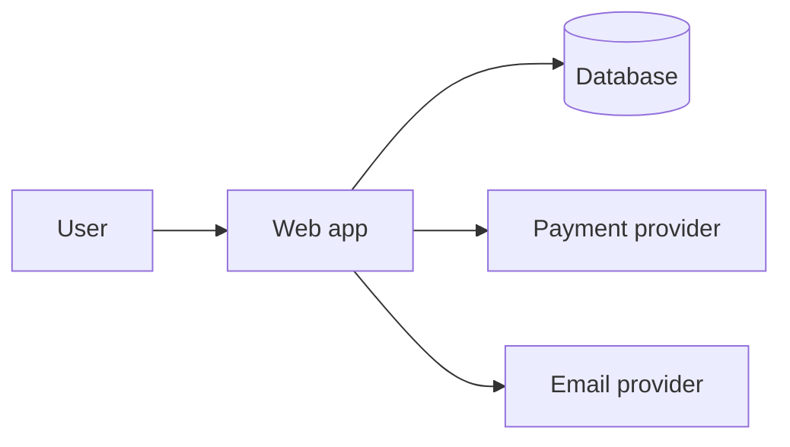

# Architecture

## Context

[One paragraph: what the system is and its main external dependencies.]

## Modules

| Module | Path | Responsibility | Depends on |
| --- | --- | --- | --- |
| [UI] | [src/app] | [Pages and components] | [server] |
| [Server] | [src/server] | [Business logic, data access] | [db] |

## Key flows

[Describe the two most important journeys as sequence diagrams or numbered steps.]

## Cross-cutting

- Auth: [approach, see docs/AUTHENTICATION_AUTHORIZATION.md]
- Errors: [approach, see docs/ERROR_HANDLING.md]
- Caching: [what, where, invalidation]
- Background work: [jobs, queues, cron]
- Configuration: environment variables, see .env.example

## Technology choices

| Area | Choice | Why | Rejected |
| --- | --- | --- | --- |
| [Framework] | [ ] | [ ] | [ ] |

## Trade-offs and debt

- [Known compromise and when to revisit]

Significant decisions are recorded in docs/adr/.
