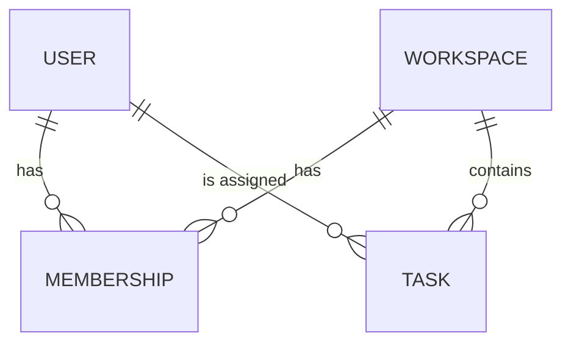

# Database schema

<!--
Explains the model. The migrations in [migrations path] are the source of truth.
If this file and the migrations disagree, the migrations win; update this file.
-->

Database: [Postgres 17 / MySQL / SQLite / MongoDB]. Access through [ORM or query layer] in [path].

## Entity relationships

## Tables

### [tasks]

| Column | Type | Constraints | Notes |
| --- | --- | --- | --- |
| id | uuid | primary key | |
| workspace_id | uuid | not null, references workspaces | isolation key |
| title | text | not null, length 1 to 120 | |
| status | text | check in (open, done) | |
| created_at | timestamptz | not null, default now() | |

Indexes:
- (workspace_id, status, created_at desc) for the main task list query.

## Access and isolation

- Every query filters by [workspace_id / user_id] taken from the server-side session.
- [Row-level security rules, if used]

## Retention

- [What gets deleted when, e.g. tasks removed 30 days after workspace deletion]
