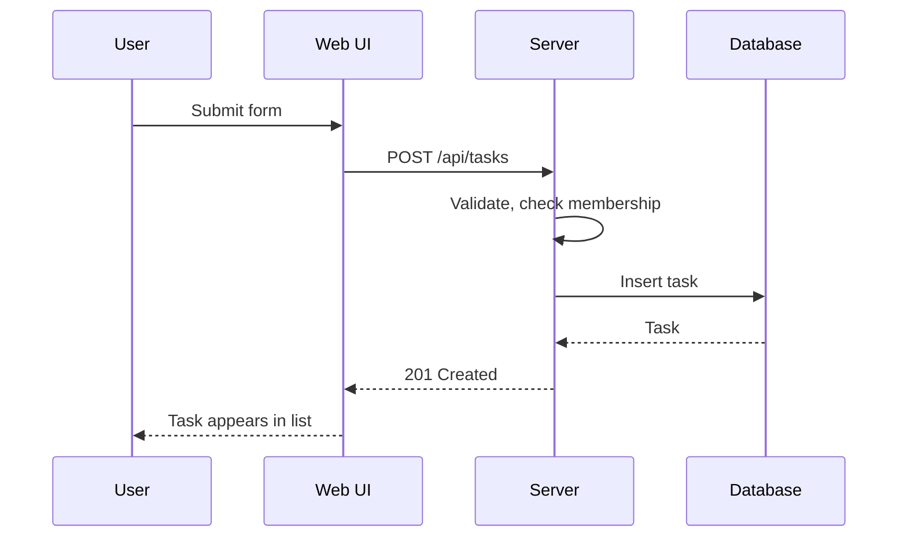

# Data flow

## [Journey, e.g. Create a task]

## State management

- Server state: [approach, e.g. fetched on the server, revalidated after mutations]
- Client state: [approach and library]
- Where side effects happen: [ ]
