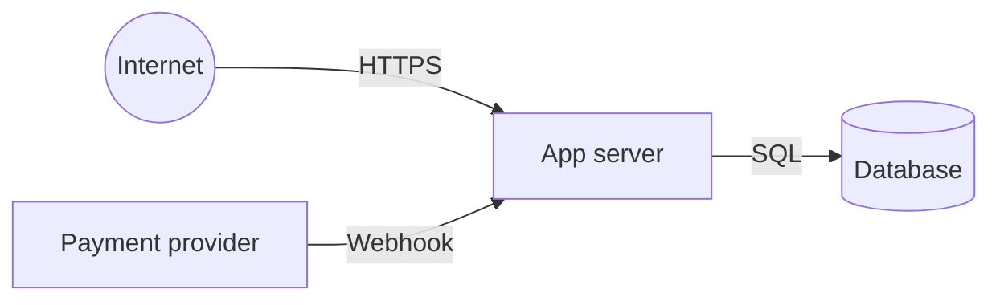

# Threat model: [system or feature]

Date: [YYYY-MM-DD]. Based on docs/ARCHITECTURE.md.

## Assets

- [User accounts, payment state, private tasks, API keys]

## Trust boundaries

## Threats (STRIDE)

| ID | Threat | Category | Likelihood | Impact | Existing control | Gap | Test |
| --- | --- | --- | --- | --- | --- | --- | --- |
| TM-1 | User reads another workspace's tasks | Information disclosure | Medium | High | workspace_id from session | none | [test] |
| TM-2 | Forged billing webhook | Spoofing | Medium | High | none | verify signature | [test] |
| TM-3 | Prompt injection via user content read by an AI feature | Tampering | Medium | Medium | none | [control] | [test] |

## Prioritized fixes

1. [Fix] (closes TM-2)
