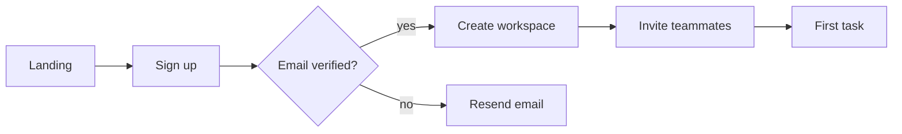

# User flows

## [Flow name, e.g. Onboarding]

```mermaid
flowchart LR
  A[Landing] --> B[Sign up]
  B --> C{Email verified?}
  C -- yes --> D[Create workspace]
  C -- no --> E[Resend email]
  D --> F[Invite teammates]
  F --> G[First task]
```

Happy path: [steps]
Failure paths: [what happens on errors, abandonment, expired links]
Covered by end-to-end test: [path]
